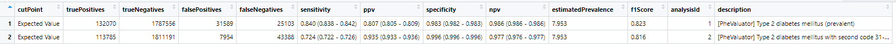

```{r, echo = FALSE, message = FALSE, warning = FALSE}
library(PheValuator)
```
\newpage
# Introduction

The `PheValuator` package enables evaluating the performance characteristics of phenotype algorithms (PAs) using data from databases that are translated into the Observational Medical Outcomes Partnership Common Data Model (OMOP CDM).

This vignette describes how to run the PheValuator process from start to end in the `PheValuator` package. 

# Overview of Process 

There are several steps in performing a PA evaluation:

1. Creating the extremely specific (xSpec), extremely sensitive (xSens), prevalence, and evaluation cohorts
2. Creating the Diagnostic Predictive Model and the Evaluation Cohort using the PatientLevelPrediction (PLP) package and evaluating the PAs
3. Examining the results of the evaluation

Each of these steps is described in detail below.  For this vignette, we will describe the evaluation of PAs for type 2 diabetes mellitus (T2DM).

## Creating the Extremely Specific (xSpec), Extremely Sensitive (xSens), Prevalence, and Evaluation Cohorts

The extremely specific (xSpec), extremely sensitive (xSens), prevalence, and evaluation cohorts are developed using the ATLAS tool.  The xSpec is a cohort where the subjects in the cohort are likely to be positive for the health outcome of interest (HOI) with a very high probability.  This may be achieved by requiring that subjects have multiple condition codes for the HOI in their patient record.  An [**example**](https://atlas-demo.ohdsi.org/#/cohortdefinition/1769699) of this for T2DM is included in the OHDSI ATLAS repository.  In this example each subject has at least 2 diagnosis codes for T2DM in days 21 to 1 prior to an index clinical visit, the first of which is the the first diagnosis in the patients history.  The algorithm also excludes subjects with type 1 DM (T1DM) any time in their record.  This is a very specific algorithm for T2DM as it ensures that the subjects in this cohort have a very high probability for having the condition of T2DM.  This PA also specifies that subjects are required to have at least 365 days of prior and post-index observation in their patient record.

**Quick Tip:** When building the xSpec cohort, the days prior where you are looking for 2 or more diagnosis codes for the condition should be altered depending on the condition.  For very rare conditions you may need to expand it to 60 to 1 days prior to index.  For acute conditions such as myocardial infarction it is best to have a very short interval such as 1 to 1 day prior to index (i.e., the day prior to index)

An example of an xSens cohort is created by developing a PA that is very sensitive for the HOI.  The system uses the xSens cohort to create a set of "noisy" negative subjects, i.e., subjects with a high likelihood of not having the HOI.  This group of subjects will be used in the model building process and is described in detail below.  An [**example**](https://atlas-demo.ohdsi.org/#/cohortdefinition/1770120) of an xSens cohort for T2DM is also in the OHDSI ATLAS repository.

The system uses the prevalence cohort to provide a reasonable approximation of the prevalence of the HOI in the population. This improves the calibration of the predictive model.  This group of subjects will be used in the model building process and is described in detail below.  An [**example**](https://atlas-demo.ohdsi.org/#/cohortdefinition/1770119) of an prevalence cohort for T2DM is also in the OHDSI ATLAS repository.

PheValuator uses the evaluation cohort to define a specific set of subjects to test for the outcome of interest and uses these subjects to evaluate the PAs.  An [**example**](https://atlas-demo.ohdsi.org/#/cohortdefinition/1778258) of an evaluation cohort for T2DM is also in the OHDSI ATLAS repository.

**Quick Tip:** You can build your required cohorts easily by exporting the JSON in the examples above and copying them into your repository.  The only changes you should need to make are changing the concept sets for the condition and the days prior to index for searching for multiple diagnosis codes in the xSpec cohort.

For the example below, two more phenotype algorithms were created:

1) An example of a prevalent algorithm for T2DM [**(Type 2 Diabetes Mellitus (prevalent))**](https://atlas-demo.ohdsi.org/#/cohortdefinition/1778259)
2) An example of a prevalent algorithm for T2DM requiring a second condition code for T2DM 31-365 days after index [**(Type 2 diabetes mellitus (prevalent) with second code 31-365 days after index)**](https://atlas-demo.ohdsi.org/#/cohortdefinition/1778260)

## Evaluating phenotype algorithms for health conditions
The basic steps in the process are as follows:

1) Use the createDefaultCovariateSettings() function to set the parameters for data extraction:
* excludedCovariateConceptIds - set the concept Ids that should be excluded from the model building process.  Any concepts that are included in the xSpec or xSens cohorts in the feature extraction windows (see below) must be excluded.  In the T2DM example, based on the xSpec cohort definition, the T1DM concept and it's descendants will be excluded.
* addDescendantsToExclude - set to TRUE/FALSE whether descendants of the excluded parameters should also be excluded
* startDayWindow1 - sets the start of the first feature extraction window
* endDayWindow1 - sets the end of the first feature extraction window
* startDayWindow2 - sets the start of the second feature extraction window
* endDayWindow2 - sets the end of the second feature extraction window
* startDayWindow3 - sets the start of the third feature extraction window
* endDayWindow3 - sets the end of the third feature extraction window

For example:
```{r tidy=FALSE,eval=FALSE}
options(andromedaTempFolder = "c:/temp2/ff") #place to store large temporary files

CovSettings <- createDefaultCovariateSettings(excludedCovariateConceptIds = c(201254),
                                              addDescendantsToExclude = TRUE,
                                              startDayWindow1 = 0,
                                              endDayWindow1 = 30,
                                              startDayWindow2 = 31,
                                              endDayWindow2 = 180,
                                              startDayWindow3 = 181,
                                              endDayWindow3 = 365)

```

**Quick Tip:** The feature extraction windows above are useful for chronic conditions.  For acute conditions, such as myocardial infarction, you should use:
```{r tidy=FALSE,eval=FALSE}
options(andromedaTempFolder = "c:/temp2/ff") #place to store large temporary files

CovSettings <- createDefaultCovariateSettings(startDayWindow1 = 0,
                                              endDayWindow1 = 10,
                                              startDayWindow2 = 11,
                                              endDayWindow2 = 20,
                                              startDayWindow3 = 21,
                                              endDayWindow3 = 30)

```

2) Use the createCreateEvaluationCohortArgs() function to set the model building and evaluation parameters
* xSpecCohortId - set the xSpec cohort ID
* xSensCohortId - set the xSens cohort ID
* prevalenceCohortId - set the prevalence cohort ID
* evaluationPopulationCohortId - set the evaluation cohort ID
* covariateSettings - use the covariate settings created with the createDefaultCovariateSettings() function above


For example:
```{r tidy=FALSE,eval=FALSE}
CohortArgs <- createCreateEvaluationCohortArgs(xSpecCohortId = 1769699,
                                               xSensCohortId = 1770120,
                                               prevalenceCohortId = 1770119,
                                               evaluationPopulationCohortId = 1778258,
                                               covariateSettings = CovSettings)
```

3) Use the createTestPhenotypeAlgorithmArgs() function to set the parameters for evaluating phenotype algorithms
* phenotypeCohortId - set the phenotype algorithm (cohort) ID to evaluate

For example:
```{r tidy=FALSE,eval=FALSE}
#First phenotype algorithm to test
conditionAlg1TestArgs <- createTestPhenotypeAlgorithmArgs(phenotypeCohortId =  1778259) 
```

4) Use the createPheValuatorAnalysis() function to set up the phenotype algorithm analyses to run
* analysisId - set a unique value for the analysis in the run
* description - set a text string for the name of the analysis
* createEvaluationCohortArgs - use the createCreateEvaluationCohortArgs() settings created above
* testPhenotypeAlgorithmArgs - use the createTestPhenotypeAlgorithmArgs() settings created above

For example:
```{r tidy=FALSE,eval=FALSE}
analysis1 <- createPheValuatorAnalysis(analysisId = 1,
                                       description = "[PheValuator] Type 2 Diabetes Mellitus 
                                                    (prevalent)",
                                       createEvaluationCohortArgs = CohortArgs,
                                       testPhenotypeAlgorithmArgs = conditionAlg1TestArgs)

```
Create as many analyses as needed:

For example:
```{r tidy=FALSE,eval=FALSE}
#Second phenotype algorithm to test
conditionAlg2TestArgs <- createTestPhenotypeAlgorithmArgs(phenotypeCohortId = 1778260,
                                                          washoutPeriod = 0)

analysis2 <- createPheValuatorAnalysis(analysisId = 2,
                                       description = "[PheValuator] Type 2 diabetes mellitus 
                                                    with second code 31-365 days after index",
                                       createEvaluationCohortArgs = CohortArgs,
                                       testPhenotypeAlgorithmArgs = conditionAlg2TestArgs)

#save the analyses
pheValuatorAnalysisList <- list(analysis1, analysis2)
```

5) Use the runPheValuatorAnalyses() function to start the analysis run
* connectionDetails - set your connection details using the DatabaseConnector::createConnectionDetails()
* cdmDatabaseSchema - set the location of your database schema
* cohortDatabaseSchema - set the location of your cohort schema
* cohortTable - set the name of your cohort table in your cohort schema
* workDatabaseSchema - set the location of a database where you have write access for temporary tables
* outputFolder - provide a name for an output folder to store your results
* pheValuatorAnalysisList - create a list of your analysis IDs created using the createPheValuatorAnalysis() function above

For example:
```{r tidy=FALSE,eval=FALSE}
#create database connection details
connectionDetails <- createConnectionDetails(dbms = "postgresql",
                                             server = "localhost/ohdsi",
                                             user = "joe",
                                             password = "supersecret")

#run the PheValuator process
referenceTable <- runPheValuatorAnalyses(connectionDetails = connectionDetails,
                                         cdmDatabaseSchema = "yourCDMSchema",
                                         cohortDatabaseSchema = "yourCohortSchema",
                                         cohortTable = "yourCohortTableSchema",
                                         workDatabaseSchema = "yourWritableSchema",
                                         outputFolder = "yourOutputFolderSchema",
                                         pheValuatorAnalysisList = pheValuatorAnalysisList)
```

6) You can view the results from the analyses using the summarizePheValuatorAnalyses() function providing the results from the runPheValuatorAnalyses() function above

For example:
```{r tidy=FALSE,eval=FALSE}
#view the results of the phenotype evaluation
View(summarizePheValuatorAnalyses(referenceTable, "yourOutputFolderSchema"))
write.csv(phenotypeResults, "c:/phenotyping/diabetes_results.csv", row.names = FALSE)
```

The results from above will look like:



## Output from the process
The runPheValuatorAnalyses() function will produce the following artifacts:   

1) A Patient Level Prediction file (in .rds format) containing the information from the model building process   
2) A Patient Level Prediction file (in .rds format) containing the information from applying the model to the evaluation cohort
3) All the results from the phenotype algorithm analyses (in .rds format)


